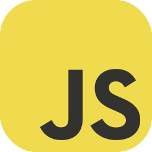
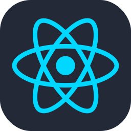

<h1 style="text-align:center;">Hi there 👋, I'm Devan</h1>

- 
🤔 I'm interested in backend development and competitive programming 

-  
 🌱 I’m currently learning backend, such as laravel, golang and competitive programming too. 

-  
 👩🏻‍💻 Also currently learning frontend stack such as nextjs 

-  
 👯 I’m looking to collaborate with frontend developers so i can make use of my trash shitty api  

<h2 align="left">🌐 Connect with me:</h2>

<h2 align="left">🧰 Languages and Tools:</h2>

<h2>🗃️ Alt Repo </h2>

If you are looking for my university source code, you might found what you're looking for in this alt github account : <a href="https://github.com/dvnf10cpp">Alt Github</a>

<h2>📊 Stats </h2>  
  

