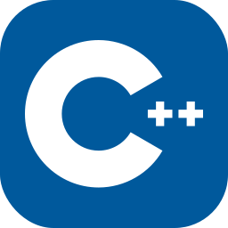

<h1>Hi there 👋, I'm Devan</h1>

- 🤔 I'm interested in backend development and competitive programming
- 🌱 I’m currently learning backend, such as laravel, node js, golang and competitive programming too.
- 👯 I’m looking to collaborate with frontend developers so i can make use of my trash shitty api 

<h2 align="left">🌐 Connect with me:</h2>

<h2 align="left">🧰 Languages and Tools:</h2>

<h2>🗃️ Alt Repo </h2>

If you are looking for my universities source code, you can found what you're looking for in this alt github account : [Alt Github](https://github.com/dvnf10cpp)

<h2>📊 Stats </h2>  
  

